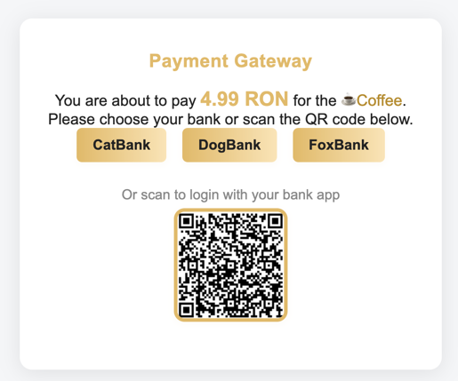
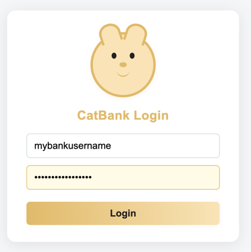
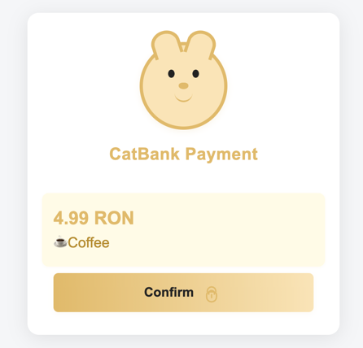

# mock-bank
This application provides some endpoints to simulate a payment is confirmed by the user.

### Initiate payment

A consumer application can initiate a payment given some information 
is available from the customer:

```http request
PUT http://localhost:8081/api/payments
Content-Type: application/json
Content-Length: 243
User-Agent: IntelliJ HTTP Client/IntelliJ IDEA 2025.1.2
Accept-Encoding: br, deflate, gzip, x-gzip
Accept: */*

{
    "amount": 4.99,
    "currency": "EUR",
    "paymentId": "abc-123",
    "returnUrl": "http://localhost:8080",
    "description": "☕️Coffee",
    "email" : "test@example.com",
    "providerId": "catbank",
    "source_user_id": "1001"
}
```
The customer is redirected to this mock application so that the customer can choose the bank to confirm the payment:
`http://localhost:8081/?id=076c6f28-8353-4c21-829e-8f3f2c04e8d1`

Alternatively, one can display a QR code the customer can use to access the mock bank:
```html

```




### Mock bank login
All mock banks allow any credentials to be used to login:



### Confirm payment
The customer can confirm the payment when seeing the payment details:



__Note that `FoxBank` always moves the payment to status `Failed`__

### Redirect to your app
After the customer confirms the payment he is redirect to the consumer app:
`http://localhost:8080/payments.html?id=076c6f28-8353-4c21-829e-8f3f2c04e8d1`

### Payment status
The consumer app can check the status of the payment using this endpoint:

```http request
GET http://localhost:8081/api/payments/076c6f28-8353-4c21-829e-8f3f2c04e8d1

HTTP/1.1 200 
Content-Type: application/json
Transfer-Encoding: chunked
Date: Tue, 16 Sep 2025 07:33:30 GMT

{
  "id": "076c6f28-8353-4c21-829e-8f3f2c04e8d1",
  "url": "http://localhost:8081/?id=076c6f28-8353-4c21-829e-8f3f2c04e8d1",
  "qrCode": "dummy-qr-code-for-076c6f28-8353-4c21-829e-8f3f2c04e8d1",
  "token": "dummy-token-for-076c6f28-8353-4c21-829e-8f3f2c04e8d1",
  "description": "☕️Coffee",
  "amount": 4.99,
  "status": "Done"
}
```

### Auto update payment status
To configure the payments to be moved automatically to a certain status we can pass a program arguments: `--mock-bank.autoUpdateStatus=Failed` to fail all payments.
This transition happens every 10 seconds for New payments.

### Docker stuff

To build/publish new image:

```shell
mvn spring-boot:build-image
docker tag docker.io/library/mock-bank:0.0.1-SNAPSHOT mihaitatinta/mock-bank:latest
docker push mihaitatinta/mock-bank:latest
```

To run the app with docker:

```shell
docker run -it -p 8081:8081 mihaitatinta/mock-bank:latest -- sh
```